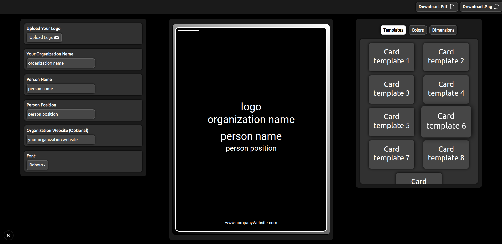

# Events Cards Generator

A modern web application for creating customizable event cards with multiple templates, color schemes, and design options. Built with Next.js and TypeScript.


## Features

- **9 Unique Templates** - Choose from various pre-designed card layouts
- **Customizable Colors** - Full control over background gradients, text, and accent colors
- **Flexible Dimensions** - Adjust card size and border radius
- **Logo Upload** - Add your organization's logo
- **Font Selection** - 30+ fonts including English and Arabic typography
- **Export Options** - Download cards as high-quality PNG or PDF files
- **Real-time Preview** - See changes instantly as you design
- **Responsive Design** - Optimized for desktop screens (1400px+)

## Screenshots

### Main Interface



The application features a clean, dark-themed interface with three main sections:

- **Left Sidebar**: Input fields for card content and logo upload
- **Center**: Live card preview
- **Right Panel**: Design customization options (templates, colors, dimensions)

## Getting Started

### Prerequisites

- Node.js 18+
- npm or yarn package manager

### Installation

1. Clone the repository:

```bash
git clone https://github.com/yourusername/events-cards-generator.git
cd events-cards-generator
```

2. Install dependencies:

```bash
npm install
# or
yarn install
```

3. Run the development server:

```bash
npm run dev
# or
yarn dev
```

4. Open [http://localhost:3000](http://localhost:3000) in your browser

## Usage

### Creating a Card

1. **Add Content** (Left Sidebar):

   - Upload your organization logo
   - Enter organization name
   - Enter person name
   - Enter person position
   - Add website URL (optional)
   - Select a font

2. **Choose a Template** (Right Panel - Templates Tab):

   - Browse through 9 different card designs
   - Click to select your preferred template

3. **Customize Colors** (Right Panel - Colors Tab):

   - Set background gradient colors
   - Adjust gradient angle
   - Customize text color
   - Set primary, secondary, and third accent colors

4. **Adjust Dimensions** (Right Panel - Dimensions Tab):

   - Modify card height
   - Modify card width
   - Adjust border radius

5. **Export**:
   - Click "Download .Pdf" for PDF format
   - Click "Download .Png" for PNG format (3x resolution)

## Project Structure

```
events-cards-generator/
├── app/
│   ├── globals.css          # Global styles
│   ├── layout.tsx           # Root layout
│   └── page.tsx             # Main page component
├── public/
│   ├── API/
│   │   ├── fonts.json       # Available fonts
│   │   └── templates.json   # Template definitions
│   ├── Components/
│   │   ├── CardDesign/      # Card preview component
│   │   ├── Designs/         # Design customization panel
│   │   ├── HeadBar/         # Download buttons
│   │   ├── ScreenError/     # Screen size warning
│   │   └── SideBar/         # Input fields sidebar
│   └── Store/
│       └── useCardStore.ts  # Zustand state management
├── package.json
└── README.md
```

## Technologies Used

- **Framework**: Next.js 14+ (App Router)
- **Language**: TypeScript
- **Styling**: CSS Modules + Bootstrap 5
- **State Management**: Zustand
- **PDF Generation**: jsPDF
- **Image Capture**: html2canvas
- **Icons**: React Icons

## Available Fonts

The application includes 30+ fonts supporting both English and Arabic:

**English Fonts**: BBHSansHegarty, Bungee, JosefinSans, Owsland, PlaywriteDESAS, Roboto, ShareTech, TitilliumWeb, Ubuntu, Arvo, Caveat, IndieFlower, LobsterTwo, Michroma, Orbitron, ReadexPro, SedanSC

**Arabic Fonts**: Alkalami, Almarai, Amiri, Cairo, CairoPlay, Exo2, Lalezar, Lemonada, Mada, PlaypenSansArabic, Rakkas, ReemKufi, ReemKufiFun, SmoochSans, Zain, BadeenDisplay

## Browser Compatibility

- Chrome 90+
- Firefox 88+
- Safari 14+
- Edge 90+

## Known Limitations

- Requires minimum screen width of 1400px
- Best viewed on desktop/laptop devices
- Mobile version not currently supported

## Contributing

Contributions are welcome! Please feel free to submit a Pull Request.

## Support

For issues and questions, please open an issue on the GitHub repository.

## Copyright

© 2025. All rights reserved.

This software and associated documentation files are proprietary. Unauthorized copying, modification, distribution, or use of this software, via any medium, is strictly prohibited without explicit permission from the copyright holder.

---

**Note**: This application is designed for desktop use only and requires a minimum screen width of 1400 pixels for optimal functionality.
